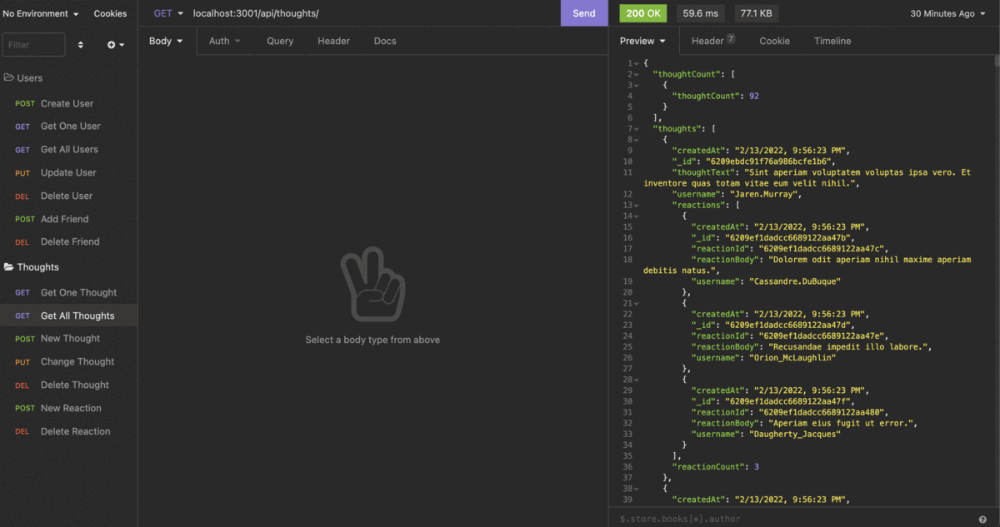

# Socialist Network Api
  
  [](https://opensource.org/licenses/MIT)

  ## Description

  Social network applications have large databases with a variety of information. MongoDB is an efficient way to store this data. As a result, I made this mock-up to try to get a better handle on how it works. Users have thought and friend subdocuments while thoughts have reaction subdocuments. 

  ### Table of Contents

  * [Installation](#installation)
  * [Usage](#usage)
  * [Contribution Guidelines](#contribution-guidelines)
  * [Tests](#tests)
  * [Questions](#questions)
  

  ## Installation

  Download this repo, seed the database by typing in the command line
  ```
  npm run seed
  ``` 
  
  launch the server by typing in the command line 
  ```
  npm run start
  ```

  ## Usage

  

  Using an api-testing tool, try out these routes:


  **`/api/users`**

  * `GET` all users

  * `GET` a single user by its `_id` and populated thought and friend data

  * `POST` a new user:

  ```json
  // example data
  {
    "username": "lernantino",
    "email": "lernantino@gmail.com"
  }
  ```

  * `PUT` to update a user by its `_id`

  * `DELETE` to remove user by its `_id`

  ---

  **`/api/users/:userId/friends/:friendId`**

  * `POST` to add a new friend to a user's friend list

  * `DELETE` to remove a friend from a user's friend list

  ---

  **`/api/thoughts`**

  * `GET` to get all thoughts

  * `GET` to get a single thought by its `_id`

  * `POST` to create a new thought (don't forget to push the created thought's `_id` to the associated user's `thoughts` array field)

  ```json
  // example data
  {
    "thoughtText": "Here's a cool thought...",
    "username": "lernantino",
    "userId": "5edff358a0fcb779aa7b118b"
  }
  ```

  * `PUT` to update a thought by its `_id`

  * `DELETE` to remove a thought by its `_id`

  ---

  **`/api/thoughts/:thoughtId/reactions`**

  * `POST` to create a reaction stored in a single thought's `reactions` array field

  * `DELETE` to pull and remove a reaction by the reaction's `reactionId` value


  ## Contribution Guidelines

  Submit bug or feature requests


  ## Questions

  If you have any questions, you may contact me at: 

  * Github: https://github.com/anguswaffle
  * Email: aidan.bachtell@gmail.com

  ---

  ## License 

  Licensed under [MIT License](https://opensource.org/licenses/MIT). 
